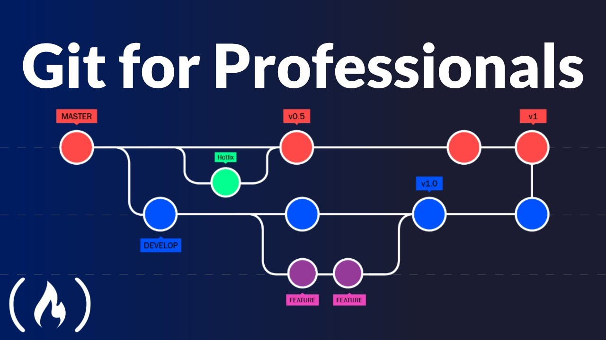

<a name="readme-top"></a>

<!-- PROJECT SHIELDS -->
[![Contributors][contributors-shield]][contributors-url]
[![Forks][forks-shield]][forks-url]
[![Stargazers][stars-shield]][stars-url]
[![Issues][issues-shield]][issues-url]
[![MIT License][license-shield]][license-url]
[![LinkedIn][linkedin-shield]][linkedin-url]

<!-- PROJECT LOGO -->
<br />
<div align="center">
  <a href="https://github.com/marcossilvestrini/alura-devops-training">
    
  </a>

<h3 align="center">Git Training</h3>

  <p align="center">
    Alura Devops Training
    <br />
    <a href="https://github.com/marcossilvestrini/alura-devops-training"><strong>Explore the docs »</strong></a>
    <br />
    <br />
    <a href="https://github.com/marcossilvestrini/alura-devops-training">View Demo</a>
    -
    <a href="https://github.com/marcossilvestrini/alura-devops-training/issues">Report Bug</a>
    -
    <a href="https://github.com/marcossilvestrini/alura-devops-training/issues">Request Feature</a>
  </p>
</div>

<!-- TABLE OF CONTENTS -->
<details>
  <summary>Table of Contents</summary>
  <ol>
    <li>
      <a href="#about-the-project">About The Project</a>
      <ul>
        <li><a href="#built-with">Built With</a></li>
      </ul>
    </li>
    <li>
      <a href="#getting-started">Getting Started</a>
      <ul>
        <li><a href="#prerequisites">Prerequisites</a></li>
        <li><a href="#installation">Installation</a></li>
      </ul>
    </li>
    <li><a href="#usage">Usage</a></li>
    <li><a href="#roadmap">Roadmap</a></li>
    <li><a href="#contributing">Contributing</a></li>
    <li><a href="#license">License</a></li>
    <li><a href="#contact">Contact</a></li>
    <li><a href="#acknowledgments">Acknowledgments</a></li>
  </ol>
</details>

<!-- ABOUT THE PROJECT -->
## About The Project

Project for share content about alura devops training

<p align="right">(<a href="#readme-top">back to top</a>)</p>

### Built With

* [![Github][Github-badge]][Github-url]
* [![GNULinux][GNULinux-badge]][GNULinux-url]
* [![Windows][Windows-badge]][Windows-url]
* [![Bash][Bash-badge]][Bash-url]
* [![Powershell][Powershell-badge]][Powershell-url]

<p align="right">(<a href="#readme-top">back to top</a>)</p>

<!-- GETTING STARTED -->
## Getting Started

To get a local copy up and running follow these simple example steps.

### Prerequisites

***git***

  ```sh
  #Centos\RHEL
  sudo dnf install git-all

  #Debian\Ubuntu
  sudo apt install git-all
  ```

### Installation

1. Clone the repo

   ```sh
   git clone https://github.com/marcossilvestrini/alura-devops-training.git
   ```

<p align="right">(<a href="#readme-top">back to top</a>)</p>

<!-- USAGE EXAMPLES -->
## Usage

Clone the repo

```sh
#HTTPS
git clone https://github.com/marcossilvestrini/alura-devops-training.git

#SSH
git clone git@github.com:marcossilvestrini/alura-devops-training.git
```

*For more examples, please refer to the [Documentation](https://github.com/marcossilvestrini/alura-devops-training)*

<p align="right">(<a href="#readme-top">back to top</a>)</p>

<!-- ROADMAP -->
## Roadmap

* [x] Git e Github: o que são e primeiros passos
* [x] Começando com Git: Aprendendo a versionar
* [x] Git e Github: controle e compartilhe seu código
* [x] Git e Github: estratégias de ramificação, Conflitos e Pull Requests
* [x] Compartilhar projeto com Git e GitHub
* [x] Recuperando commits com git reflog
* [ ] Entenda os comandos git restore e switch
* [ ] Git: Os novos comandos git restore e git switch
* [ ] Git ammend: editando uma mensagem de commit
* [ ] Usando Github sem linhas de comando
* [ ] Git e Github para Sobrevivência | EP 01: Como o git funciona?
* [ ] Git e Github para Sobrevivência | EP 02: Como o merge funciona?
* [ ] Git e Github para Sobrevivência | EP 03: Como o rebase funciona?
* [ ] Git e Github para Sobrevivência | EP 04: Issues, PullRequests, Templates e features legais do Github
* [ ] Git e Github para Sobrevivência | EP 05: Como editar o último commit feito?
* [ ] Git e Github para Sobrevivência | EP 06: Como apagar um commit? Como reverter um bug na master?
* [ ] Git e Github para Sobrevivência | EP 07: Lidando com problemas de sincronização
* [ ] Git e Github para Sobrevivência | EP 08: Melhorando seu histórico com squash e !fixup
* [ ] Git e Github para Sobrevivência | EP 09: Entendendo fluxos de trabalho com Git
* [ ] Git e Github para Sobrevivência | EP 10: Os poderes do git reflog
* [ ] Git e Github para Sobrevivência | EP 11: Dicas Gerais]
* [ ] Integração Contínua, Deploy Contínuo e Github Actions – Hipsters #213

<p align="right">(<a href="#readme-top">back to top</a>)</p>

## Set your git information

```sh
# Global (all repositories)
git config --global user.name "your.name"
git config --global user.email "your.email@email.com"

# Local(only actual repository)
git config --local user.name "your.name"
git config --local user.email "your.email@email.com"
```

## Get your git configuration

```sh
# Global (all repositories)
git config --global user.name
git config --global user.email

# Local(only actual repository)
git config --local user.name
git config --local user.email

# Enables helpful colorization of command line output
git config --global color.ui auto
```

## About Repository

```sh
# Initialize repository in git server
cd project
git init --bare

# Initialize repository in client
cd project
git init

# Show status
git status

# Add file to repository
git add app.ps1

# Add multiples files to repository
git add .

# Commit files
git commit -m "Intuitive message"
```

## Git log

```sh
# Show all commits
git log

# Show all commits resumed
git log --online

# Show login graph
git log --graph

# Show all commits and alterations in this commits
git log -p

# Show commits in specific branch
git log main --oneline
git log origin/main --oneline

# Show only hash commits
git log --pretty="format:%H"
git log --pretty="format:%t"

# Show only commit message
git log --pretty="format:%s"

# Show hash resumed and commit message
git log --pretty="format:%h %s"

# Show hash,commit message and author
git log --pretty="format:%H %s %an"
```

## Remote repositories

```sh
# Clone repository
git clone git@github.com:marcossilvestrini/alura-devops-training

# Set remote repository
git remote add origin github.com:marcossilvestrini/alura-devops-training

# Check modifications in repository remote
git fetch --all
git fetch origin main

# Push files to remote server(github,gitlab,bitbucket,etc)
git push  --all
git push -u origin main
git push -u origin develop

# Get files in remote server(github,gitlab,bitbucket,etc)
git pull --all
git pull origin main
```

## Branches

```sh
# Show branches
git branch

# Create new branch
git branch develop
git checkout -b feature/new-feature
git switch -c [branch-name]

# Go to a specific branch
git checkout develop

# Delete branch
git branch -d <branch_name>
git branch -D <branch_name>
```

## Git merge and rebase

```sh
# Merge branch in master
git checkout master
git merge develop

# Rebase branch master
git checkout master
git rebase feature1

# Iterative rebase
git rebase -i HEAD~3
```

## Git Ctr+Z

```sh
# Discard changes in file
git checkout -- index.html

# Unstage files in stage untracked
git reset HEAD CHANGELOG.md
git restore --staged CHANGELOG.md

# Restore commits
git revert c4da079442cac2897ec69c215a2b9bb95fdfd988
```

## Git Stash

This functionality is useful when you’ve made changes to a branch that you aren’t ready to commit,
but you need to switch to another branch.

```sh
# Create stash
git stash

#Show stash
git stash list

# Apply stash
git stash apply 0
git stash pop
```

## Navigate between commits

```sh
#1 - Navigate until commit
git checkout <hash_commit>
```

## Gir diff

```sh
# Show latest project changes(only files that have not been added)
git diff

# Compare commits
git diff bca9ee9..1957f56
```

## Tags ans releases

```sh
# Show tags
git tag

# Create tag
git tag -a v1.0.0 -m "New version"

# Push tag
git push origin v1.0.0
```

## Cherry-pick

```sh
# Example: Work in new release
git checkout main
git checkout -b release-v1.1.0
#create\modify files...
git checkout main
git cherry-pick <your specific commit release-v1.1.0>
```

## Bisect

```sh
git bisect start
git bisect bad HEAD
git bisect good <your_good_commit>
#continue searching your good commit
git bisect bad
#end your search
git bisect good
git bisect reset
```

## Git show

```sh
git show <hash_commit>
```

## Git Blame

```sh
git blame <file>
```

## Git Flow

<a href="https://github.com/marcossilvestrini/alura-devops-training">
    
</a>

## Git Hooks

Folder of git hooks: .git/hooks

## Git reflog

Reference logs, or "reflogs", record when the tips of branches and other references were updated in the local repository

```sh
# find old commits
git reflog

#restore for some commit after
git cherry-pick <hash_commit>
```

## Git restore and switch (old git checkout)

```sh
# Git restore all files
git restore <hash_commit> .

# Git restore specific file
git restore <hash_commit> index.html


# Git switch
git switch develop
```

<!-- CONTRIBUTING -->
## Contributing

Contributions are what make the open source community such an amazing place to learn, inspire, and create.
Any contributions you make are **greatly appreciated**.

If you have a suggestion that would make this better, please fork the repo and create a pull request.
You can also simply open an issue with the tag "enhancement".
Don't forget to give the project a star! Thanks again!

1. Fork the Project
2. Create your Feature Branch (`git checkout -b feature/AmazingFeature`)
3. Commit your Changes (`git commit -m 'Add some AmazingFeature'`)
4. Push to the Branch (`git push origin feature/AmazingFeature`)
5. Open a Pull Request

<p align="right">(<a href="#readme-top">back to top</a>)</p>

<!-- LICENSE -->
## License

Distributed under the MIT License. See `LICENSE` for more information.

<p align="right">(<a href="#readme-top">back to top</a>)</p>

<!-- CONTACT -->
## Contact

Marcos Silvestrini - [@mrsilvestrini](https://twitter.com/mrsilvestrini) - marcos.silvestrini@gmail.com

Project Link: [https://github.com/marcossilvestrini/alura-devops-training](https://github.com/marcossilvestrini/alura-devops-training)

<p align="right">(<a href="#readme-top">back to top</a>)</p>

<!-- ACKNOWLEDGMENTS -->
## Acknowledgments

* [Github](https://github.com/)
* [Github Template by othneildrew](https://github.com/othneildrew/Best-README-Template)
* [Git gitignore Templates](https://github.com/github/gitignore)
* [Git Badges](https://github.com/Ileriayo/markdown-badges#usage)
* [Github Workflows](https://docs.github.com/en/actions/using-workflows/about-workflows)
* [Git cheatsheet](https://training.github.com/downloads/github-git-cheat-sheet/)
* [Git cola](https://git-cola.github.io/)
* [Github Desktop](https://desktop.github.com/)

<p align="right">(<a href="#readme-top">back to top</a>)</p>

<!-- MARKDOWN LINKS & IMAGES -->
<!-- https://www.markdownguide.org/basic-syntax/#reference-style-links -->
[contributors-shield]: https://img.shields.io/github/contributors/marcossilvestrini/alura-devops-training.svg?style=for-the-badge
[contributors-url]: https://github.com/marcossilvestrini/alura-devops-training/graphs/contributors
[forks-shield]: https://img.shields.io/github/forks/marcossilvestrini/alura-devops-training.svg?style=for-the-badge
[forks-url]: https://github.com/marcossilvestrini/alura-devops-training/network/members
[stars-shield]: https://img.shields.io/github/stars/marcossilvestrini/alura-devops-training.svg?style=for-the-badge
[stars-url]: https://github.com/marcossilvestrini/alura-devops-training/stargazers
[issues-shield]: https://img.shields.io/github/issues/marcossilvestrini/alura-devops-training.svg?style=for-the-badge
[issues-url]: https://github.com/marcossilvestrini/alura-devops-training/issues
[license-shield]: https://img.shields.io/github/license/marcossilvestrini/alura-devops-training.svg?style=for-the-badge
[license-url]: https://github.com/marcossilvestrini/alura-devops-training/blob/master/LICENSE
[linkedin-shield]: https://img.shields.io/badge/-LinkedIn-black.svg?style=for-the-badge&logo=linkedin&colorB=555
[linkedin-url]: https://linkedin.com/in/marcossilvestrini
[Github-badge]: https://img.shields.io/badge/github-%23121011.svg?style=for-the-badge&logo=github&logoColor=white
[Github-url]: https://github.com/
[GNULinux-badge]: https://img.shields.io/badge/Linux-FCC624?style=for-the-badge&logo=linux&logoColor=black
[GNULinux-url]: https://www.gnu.org/gnu/linux-and-gnu.en.html
[Windows-badge]: https://img.shields.io/badge/Windows-0078D6?style=for-the-badge&logo=windows&logoColor=white
[Windows-url]: https://www.microsoft.com/
[Bash-badge]: https://img.shields.io/badge/shell_script-%23121011.svg?style=for-the-badge&logo=gnu-bash&logoColor=white
[Bash-url]: https://www.gnu.org/software/bash/
[Powershell-badge]: https://img.shields.io/badge/PowerShell-%235391FE.svg?style=for-the-badge&logo=powershell&logoColor=white
[Powershell-url]: https://learn.microsoft.com/en-us/powershell/
